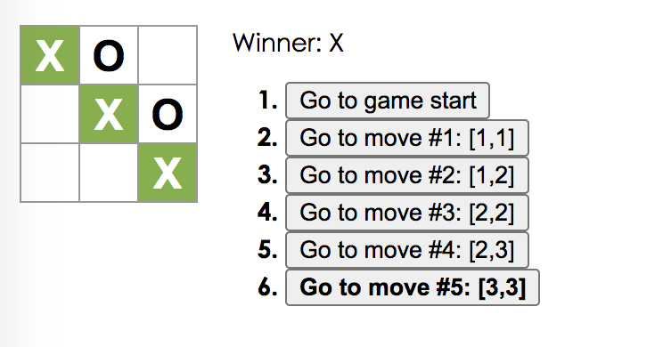
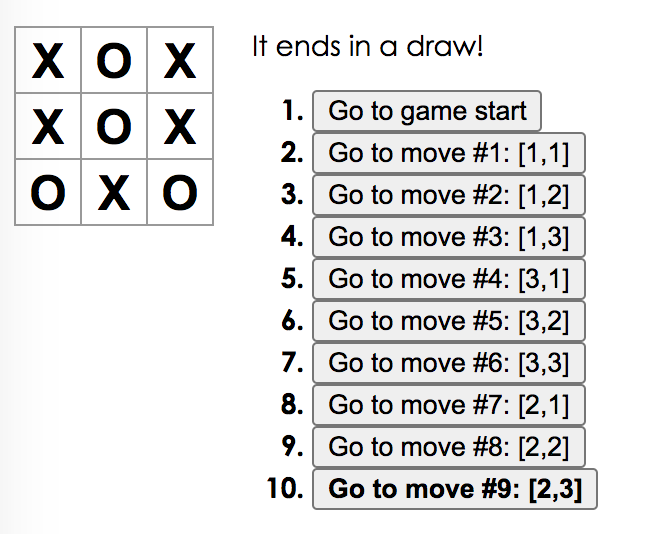

# tic-tac-toe
Build the tic-tac-toe game in React. It can alternate placing “X”s and “O”s on the board, and display a winner.

**Offical link**: [**tutorial**](https://reactjs.org/tutorial/tutorial.html#completing-the-game)

***
## Local Development Environment 
- Execute `config.sh` to create a React App
- Download the file **index.css** into the **src/** folder
- Download the file **index.js** into the **src/** folder
- Run `npm start` in the **my-app/** folder and open http://localhost:3000 in the browser

## Completing the Game
- Let you play tic-tac-toe
- Indicate the result of the winner or a draw
- Store a game’s history and display the location for each move
- Allow players to review a game’s history 
- When someone wins, highlight the squares that caused the win.
- Restart the game automatically

## Example
- when a player wins the game, it shows:
  

- when the result is a draw, it shows:
  
